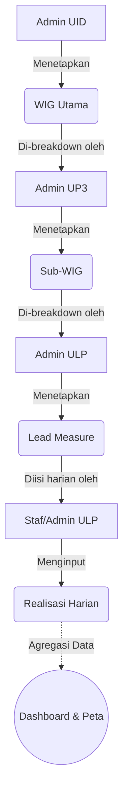

# Laporan Sistem Aplikasi 4DX PLN UID Jabar

## 1. Pendahuluan
Aplikasi 4DX (4 Disciplines of Execution) PLN UID Jabar adalah sebuah sistem informasi berbasis web yang dirancang khusus untuk memfasilitasi, melacak, dan mengeksekusi target strategis perusahaan secara terstruktur. Sistem ini mengadopsi metodologi 4DX untuk menjabarkan *Wildly Important Goal* (WIG) dari tingkat wilayah (UID) hingga ke tingkat eksekusi harian di unit layanan (ULP).

---

## 2. Arsitektur & Teknologi
- **Framework Utama:** Laravel 11 (PHP)
- **Database:** MySQL / MariaDB
- **Frontend & Styling:** Tailwind CSS, Alpine.js, Blade Templating
- **Peta Digital:** Leaflet.js (Integrasi Peta Performa)
- **Role-Based Access Control:** Spatie Laravel Permission

---

## 3. Alur Kerja (Workflow) Aplikasi
Sistem ini menggunakan alur *Cascading* (penurunan berjenjang) yang ketat, yang membagi tanggung jawab berdasarkan tingkat wewenang organisasi:

1. **Penetapan WIG Utama (UID):** Pihak manajemen UID menentukan fokus utama perusahaan yang harus diselesaikan dalam suatu periode beserta target angkanya.
2. **Breakdown Sub-WIG (UP3):** Pihak UP3 menerima WIG Utama dan menjabarkannya menjadi target spesifik untuk wilayah operasional UP3 mereka.
3. **Set Lead Measure (ULP):** Pihak ULP menerima Sub-WIG dan menentukan langkah harian/mingguan (*Lead Measure*) yang dapat dikontrol dan dieksekusi secara langsung.
4. **Input Realisasi Harian (ULP):** Petugas lapangan di ULP memasukkan angka capaian harian, memberikan catatan, serta mengunggah bukti (*evidence*) pelaksanaan tugas.
5. **Monitoring (Superadmin/UID/UP3):** Seluruh capaian diakumulasi dan dipantau secara langsung melalui Dashboard progres WIG dan Peta Spasial ULP.

---

## 4. Hak Akses dan Peran (Roles)
Aplikasi ini memiliki 4 tingkatan otorisasi yang sangat spesifik:
- **Superadmin:** Memiliki kendali penuh terhadap seluruh sistem, master data, dan semua entitas WIG.
- **Admin UID:** Memiliki hak untuk mengelola WIG Utama dan memantau seluruh UP3/ULP di bawah naungan UID.
- **Admin UP3:** Hanya dapat melihat WIG Utama, mem-breakdown target menjadi Sub-WIG khusus untuk UP3-nya, dan memantau ULP di wilayahnya.
- **Admin ULP:** Hanya dapat melihat Sub-WIG, membuat Lead Measure untuk ULP-nya, dan mengisi Realisasi Harian.

---

## 5. Fitur-Fitur Eksisting (*Existing Features*)

### A. Modul Master Data
- **Manajemen Lokasi:** Pendataan lokasi berjenjang yang memetakan hubungan antara UID, UP3 (Contoh: UP3 Bandung), dan ULP (Contoh: ULP Bandung Utara).
- **Manajemen Pengguna:** Penambahan pengguna dengan pembatasan hak akses (Role) secara dinamis.
- **Manajemen Metrik & Satuan:** Pendataan jenis ukuran keberhasilan (Misal: SAIDI, Penjualan KWh, Kunjungan Pelanggan) lengkap dengan satuannya.

### B. Modul Cascading WIG (Menu Utama)
- **Pohon Hirarki Interaktif:** Antarmuka interaktif *(collapsible/expandable)* yang memudahkan pelacakan dari WIG Utama hingga Lead Measure.
- **Badge Status Cerdas:** Indikator visual status (*Belum Mulai, On Track, Off Track*) yang rapi dan responsif.
- **Proteksi Akses UI:** Tombol Edit, Tambah Breakdown, dan Hapus secara cerdas hanya dimunculkan kepada akun (Role) yang berhak secara aturan perusahaan.

### C. Modul Realisasi Harian
- **Formulir Realisasi:** Pengisian angka harian yang terhubung langsung dengan *Lead Measure*. Mendukung pengunggahan bukti fisik (foto/dokumen).
- **Validasi Waktu Terbatas:** Data realisasi hanya dapat diedit/dihapus dalam jangka waktu **1x24 jam** sejak dibuat, untuk menjaga integritas data harian.
- **Tampilan Mobile-First:** Daftar riwayat realisasi didesain sangat ringkas (*flat list*) dan berfokus pada kenyamanan baca di layar *smartphone* tanpa perlu *scrolling* ke samping.

### D. Modul Dashboard Eksekutif
- **Kartu Progres WIG Utama:** Visualisasi persentase pencapaian (Progres Bar Dinamis) untuk tingkat UID.
- **Peta Performa ULP (Spatial Map):** Integrasi peta spasial (menggunakan titik koordinat) yang menampilkan ULP dengan kode warna performa.
- **Feed Aktivitas Realisasi:** Tampilan riwayat masuknya data secara *real-time* yang didesain estetik dan mudah dibaca (beradaptasi sempurna di versi Mobile & Desktop).

---

## 6. Nilai Jual & Keunggulan (*Unique Selling Points*)
1. **User Experience (UX) Premium:** Dibangun menggunakan palet warna yang modern, tipografi bersih, dan animasi halus. Antarmukanya memberikan kesan profesional tingkat *enterprise*.
2. **Mobile Responsive Penuh:** Seluruh menu, mulai dari tabel data hingga struktur hirarki target, dirancang 100% dapat beroperasi secara mulus melalui *smartphone* staf di lapangan.
3. **Data Security & Integrity:** Mengunci modifikasi laporan (aturan 1x24 Jam) dan akses halaman, mencegah kebocoran data antar wilayah kerja.

> [!TIP]
> Dokumen ini dapat Anda cetak ke dalam bentuk PDF atau langsung Anda salin ke presentasi PowerPoint Anda untuk ditunjukkan kepada klien (pihak manajemen PLN).
