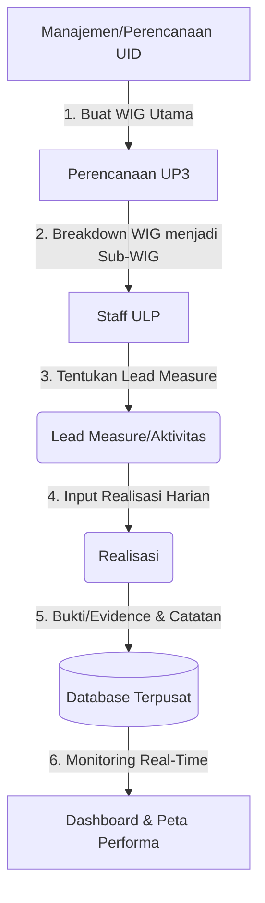

# Manual Book & Panduan Penggunaan Aplikasi 4DX PLN UID Jabar

Selamat datang di Panduan Penggunaan Aplikasi **4DX (4 Disciplines of Execution)** PLN UID Jabar. Dokumen ini disusun untuk memandu pengguna dalam mengoperasikan aplikasi berdasarkan hak akses (Role) dan bidang kerja (Matrix Group) masing-masing.

---

## DAFTAR ISI
1. [Pengenalan Sistem](#1-pengenalan-sistem)
2. [Alur Sistem (System Flow)](#2-alur-sistem-system-flow)
3. [Matrix Group (Bidang Fokus)](#3-matrix-group-bidang-fokus)
4. [Panduan Berdasarkan Hak Akses (Role)](#4-panduan-berdasarkan-hak-akses-role)
   - [A. Superadmin](#a-superadmin)
   - [B. Perencanaan UID](#b-perencanaan-uid)
   - [C. Perencanaan UP3](#c-perencanaan-up3)
   - [D. Staff ULP](#d-staff-ulp)
5. [Aturan Pengisian Data](#5-aturan-pengisian-data)

---

## 1. Pengenalan Sistem
Aplikasi 4DX adalah alat manajemen strategis yang dirancang untuk memonitor, mengeksekusi, dan mengevaluasi target (*Wildly Important Goal* / WIG) dari tingkat manajemen wilayah (UID) hingga ke operasional harian di unit layanan (ULP). 

Sistem ini memastikan bahwa semua target besar di- *breakdown* menjadi langkah kerja nyata (*Lead Measure*) yang bisa dieksekusi secara harian oleh petugas lapangan.

---

## 2. Alur Sistem (System Flow)

Sistem 4DX menggunakan prinsip penurunan (Cascading) target dari atas ke bawah. Berikut adalah visualisasi dan penjelasan alur sistemnya:

### Penjelasan Flow:
1. **Pembuatan WIG Utama (Oleh UID):** Admin UID menetapkan sasaran utama (Contoh: Menurunkan Gangguan Penyulang, Meningkatkan Pendapatan).
2. **Breakdown Target (Oleh UP3):** Pihak UP3 menerima target dari UID, kemudian membagi target tersebut ke masing-masing ULP di bawah wewenangnya (Sub-WIG).
3. **Penentuan Lead Measure (Oleh ULP):** ULP merancang aktivitas harian/mingguan yang spesifik untuk mencapai target Sub-WIG yang diberikan UP3.
4. **Input Realisasi Harian (Oleh ULP):** Setiap hari, Staff ULP melaporkan hasil kerja, memasukkan angka capaian, catatan, dan foto/dokumen bukti pelaksanaan.
5. **Agregasi Data:** Seluruh data realisasi akan terakumulasi secara otomatis untuk menghitung progres dari tingkat ULP, naik ke UP3, hingga total UID.
6. **Monitoring (UID/UP3):** Eksekutif memantau pencapaian melalui Dashboard dan Peta Kinerja (*Spatial Map*).

---

## 3. Matrix Group (Bidang Fokus)

Untuk memastikan pengguna hanya melihat target yang relevan dengan pekerjaannya, sistem mengelompokkan pengguna ke dalam **Matrix Group**. Saat pengguna login, mereka hanya dapat mengakses target (WIG) sesuai bidangnya:

1. **ALL:** Akses ke semua bidang (Biasanya untuk Superadmin atau Manajemen Puncak).
2. **NIAGA:** Fokus pada Pelayanan Pelanggan, Pemasaran, Penagihan, dan Niaga.
3. **JARINGAN:** Fokus pada Keandalan Distribusi, Pemeliharaan Jaringan, dan Penanganan Gangguan.
4. **TE (Transaksi Energi):** Fokus pada Pengukuran, P2TL, dan Efisiensi Energi.
5. **K3L:** Fokus pada Keselamatan, Kesehatan Kerja, dan Lingkungan.

---

## 4. Panduan Berdasarkan Hak Akses (Role)

Aplikasi memiliki antarmuka yang menyesuaikan dengan wewenang (*Role*) Anda. Berikut panduannya:

### A. Superadmin
Memiliki kendali teknis secara menyeluruh terhadap aplikasi.
* **Fitur Utama:** 
  - Manajemen Pengguna (Tambah, Edit, Reset Password).
  - Manajemen Master Data (Unit, Satuan, Bidang/Matrix).
  - Manajemen Master WIG & Periode.
* **Cara Penggunaan:**
  1. Masuk ke menu **Master Data**.
  2. Pastikan semua Unit (UID, UP3, ULP) sudah terdaftar dengan benar.
  3. Buat akun untuk pengguna baru di menu **Manajemen Pengguna**, pastikan **Role** dan **Matrix Group** di-assign dengan tepat.

### B. Perencanaan UID
Bertanggung jawab atas penetapan arah dan target wilayah.
* **Fitur Utama:**
  - Pembuatan WIG Utama.
  - Memonitor Dashboard Eksekutif.
  - Melihat laporan bulanan seluruh UID.
* **Cara Penggunaan:**
  1. Masuk ke menu **Cascading WIG**.
  2. Klik **Tambah WIG Utama**. Isi nama WIG, target angka, dan pilih Matrix Group (Bidang) yang bertanggung jawab.
  3. Pantau pergerakan pencapaian ULP melalui **Dashboard > Peta Performa**.

### C. Perencanaan UP3
Sebagai perantara yang membagi target dari UID ke masing-masing ULP.
* **Fitur Utama:**
  - Melihat WIG Utama yang dibuat UID.
  - Melakukan Breakdown menjadi Sub-WIG.
  - Memonitor Realisasi ULP di wilayah UP3-nya.
* **Cara Penggunaan:**
  1. Masuk ke menu **Cascading WIG**.
  2. Cari WIG Utama yang berstatus *Active*.
  3. Klik tombol **Breakdown / Tambah Sub-WIG**. 
  4. Tetapkan porsi target angka untuk masing-masing ULP di wilayah Anda.

### D. Staff ULP
Ujung tombak eksekusi di lapangan. Bertanggung jawab menentukan langkah kerja dan menginput realisasi.
* **Fitur Utama:**
  - Melihat Sub-WIG yang ditugaskan ke ULP-nya.
  - Membuat *Lead Measure* (Aktivitas terukur).
  - Menginput Realisasi Harian.
* **Cara Penggunaan (Pembuatan Lead Measure):**
  1. Masuk ke menu **Cascading WIG**.
  2. Cari Sub-WIG milik ULP Anda.
  3. Klik **Tambah Lead Measure**. Isi aktivitas yang akan dikerjakan, target mingguan/harian, dan metrik penilaian.
* **Cara Penggunaan (Input Realisasi):**
  1. Masuk ke menu **Realisasi**.
  2. Klik tombol **Tambah Realisasi**.
  3. Pilih *Lead Measure* yang akan di-update.
  4. Masukkan angka capaian hari itu.
  5. Tulis **Catatan/Keterangan** pelaksanaan.
  6. Unggah **Bukti Fisik** (Foto lapangan/dokumen) sebagai *evidence*.
  7. Klik Simpan.

---

## 5. Aturan Pengisian Data

> [!WARNING] 
> **Aturan 1x24 Jam (Integritas Data)**
> Untuk menjaga keakuratan dan disiplin pelaporan, data Realisasi Harian yang telah diinput oleh Staff ULP **hanya dapat diedit atau dihapus dalam jangka waktu 1x24 jam**. Setelah melewati batas waktu tersebut, data akan terkunci oleh sistem secara permanen.

> [!TIP]
> **Tampilan Mobile**
> Aplikasi ini sudah 100% Mobile Responsive. Bagi Staff ULP yang berada di lapangan, Anda dapat langsung membuka aplikasi ini melalui browser HP Anda untuk mengunggah foto realisasi (evidence) langsung dari kamera HP Anda.

---
*Dokumen ini dibuat secara otomatis untuk standarisasi panduan operasional 4DX PLN UID Jabar.*
